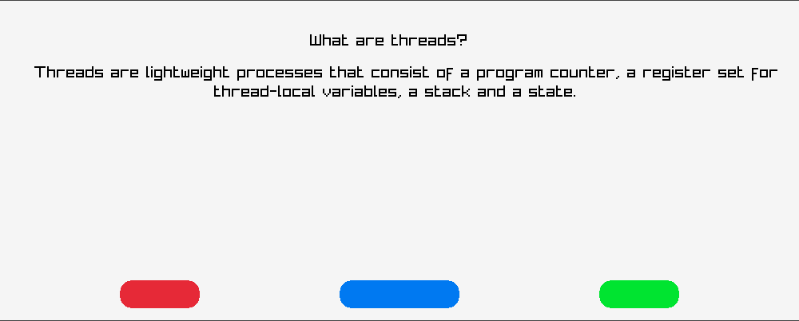

# Flashcard reader 
- simple flashcard reader that reads questions and answers from a csv file. 
- one can mark the question an easy for it to now show up again in the stack, or as hard to skip to the next question 

## TODO
- [ ] (i wanted to include a file dialog that lets u choose the csv files upon starting the app but unfortuneatly none of the crates i tried worked for my specific setup so i didnt end up including that feature)

## Examples

